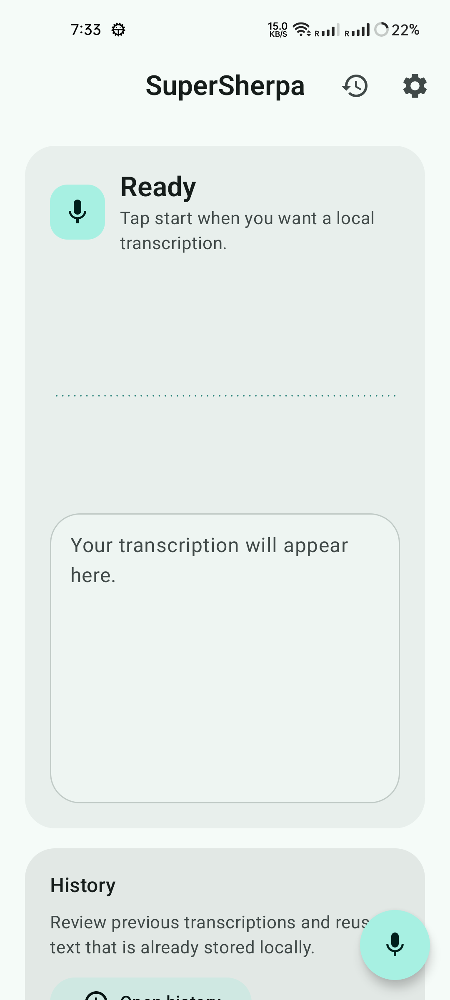
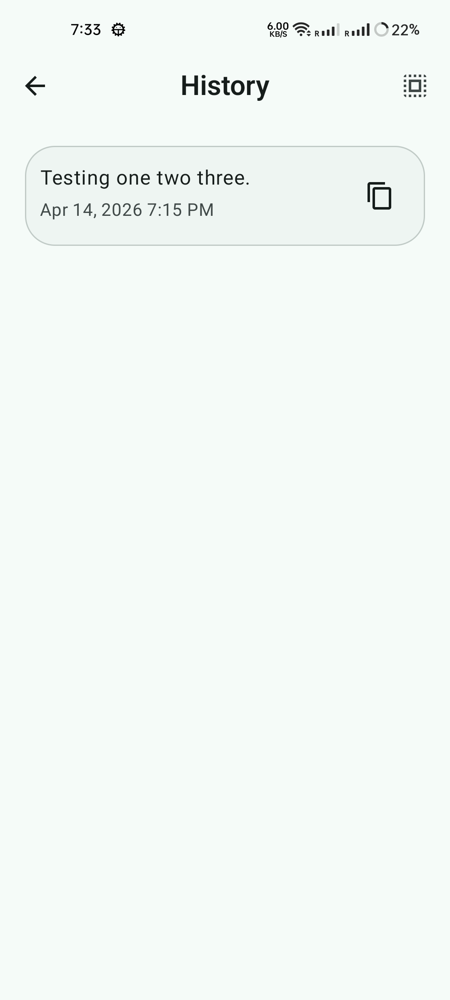
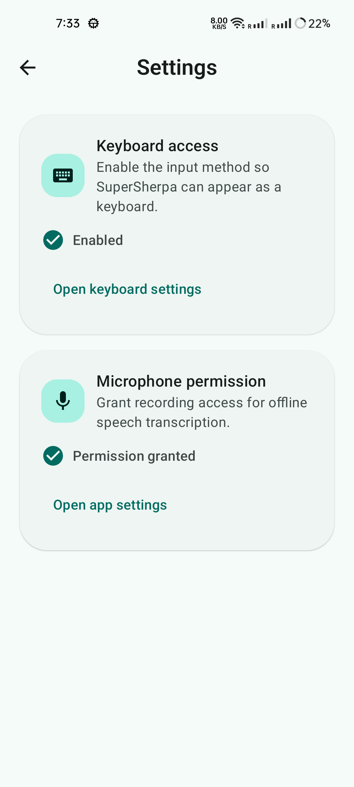
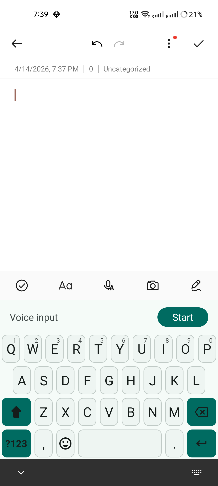
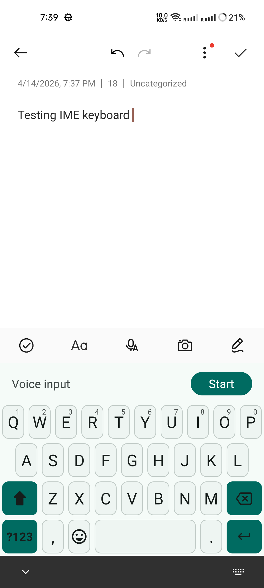
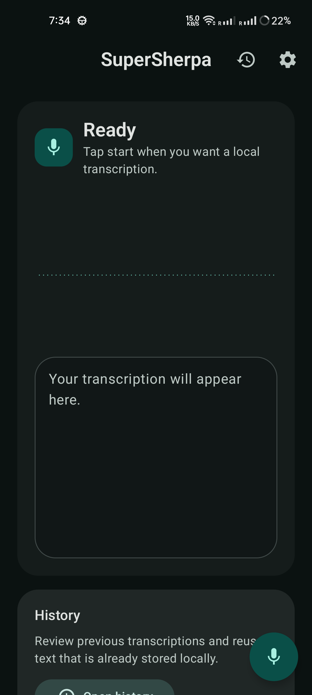
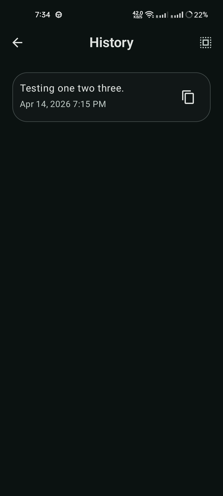
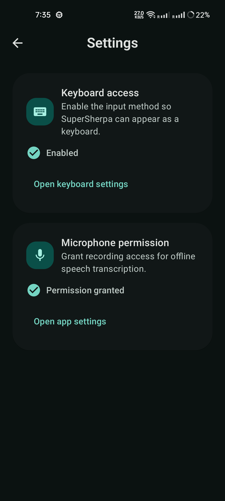
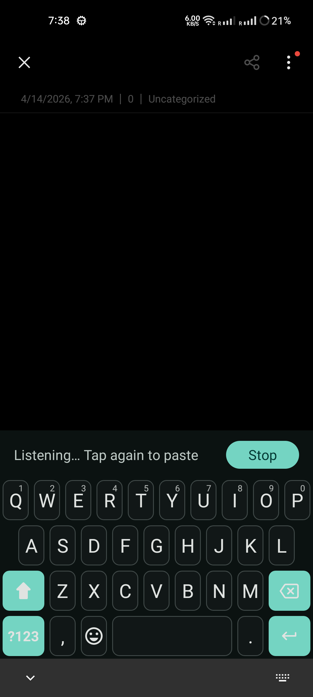
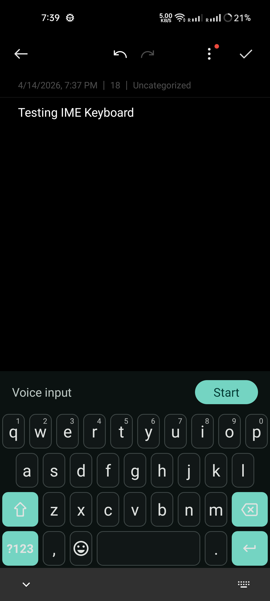

# SuperSherpa

SuperSherpa is an Android speech-to-text project built with Kotlin, Jetpack Compose, and a Rust-powered native transcription runtime. The current build focuses on recorder and keyboard workflows, while the target product direction is **Voxy**: a fully offline floating-mic transcription experience.

## Project Direction

Target MVP (Voxy):

- Floating mic overlay
- On-device speech-to-text
- Real-time transcription
- Copy to clipboard
- Fully offline runtime

Current repository status:

- Recorder-based transcription flow in the app
- Custom IME transcription flow
- JNI bridge into `transcribe-rs` for audio + transcription
- Local transcript history via Room
- OTA model install for pinned model artifacts
- No floating overlay service yet

## Repository Layout

- `app/`: Android app (Compose UI, ViewModels, Room, permissions, IME, model delivery)
- `transcribe-rs/`: Rust transcription engine and Android bridge
- `app/src/main/jniLibs/arm64-v8a/`: bundled native libraries
- `app/src/main/assets/model_delivery/manifest.json`: pinned model delivery manifest

## Runtime Flow (Current)

`Mic -> Rust native layer -> status/result callbacks -> ViewModel state -> Compose screens or IME`

Transcription runs locally after model installation. The app currently includes `INTERNET` permission because model download can happen in-app when no local model is present.

## Android Configuration Snapshot

- Package: `com.sublime.supersherpa`
- App name (current): `SuperSherpa`
- Min SDK: `26`
- Target SDK: `36`
- UI stack: Jetpack Compose + Material 3
- Persistence: Room
- Native runtime: Rust + ONNX Runtime Android

## Permissions In Use

- `android.permission.RECORD_AUDIO`
- `android.permission.FOREGROUND_SERVICE`
- `android.permission.FOREGROUND_SERVICE_MICROPHONE`
- `android.permission.INTERNET`

`SYSTEM_ALERT_WINDOW` is intentionally not declared yet because the overlay bubble/service is not implemented.

## Build and Test

Build debug APK:

```bash
./gradlew assembleDebug
```

Run JVM unit tests:

```bash
./gradlew testDebugUnitTest
```

Run instrumentation tests:

```bash
./gradlew connectedDebugAndroidTest
```

Run lint:

```bash
./gradlew lintDebug
```

## Test Coverage (Current)

- JVM tests for `TranscriptionViewModel`, `VoiceState`, history, and model delivery logic
- Android instrumentation scaffold under `app/src/androidTest/`
- Rust tests under `transcribe-rs/tests/`

## Screenshots

### Light Theme

<p>
  
  
  
  
  
</p>

### Dark Theme

<p>
  
  
  
  
  
</p>

## License

See [LICENSE](LICENSE).
